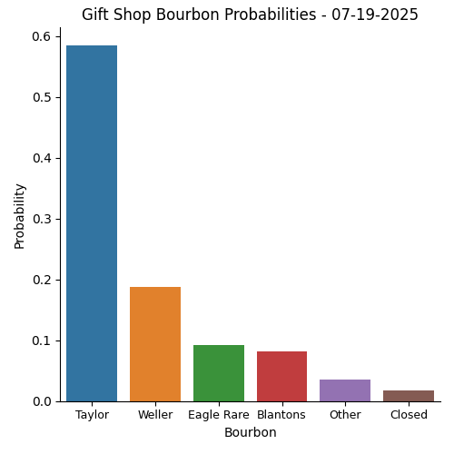

# BTB_Project
 
Welcoeme to my repository! In this project, I try to predict which bourbon is most likely to be at the Buffalo Trace Gift Shop on a given day. I use data from the Buffalo Trace Daily [website]{https://buffalotracedaily.com}. I use web scraping methods to pull from the historical data tables. When the historical data is not updated, I scrape the daily posts from the website to pull each day's bourbon. I then pre-process the data to make it ready for machine learning models. 

My next step is to build the best model to predict the outcome of which bourbon will be present in the gift shop. 

